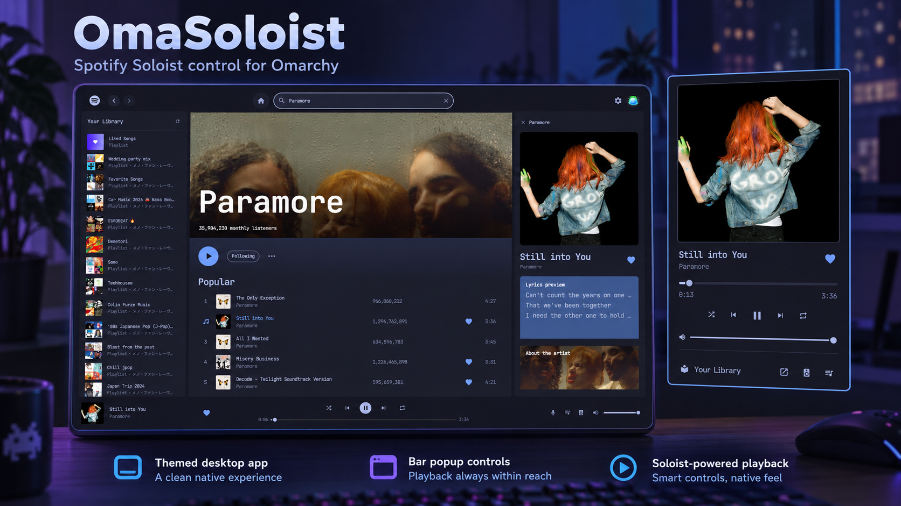

# OmaSoloist



Spotify in the [Omarchy](https://omarchy.org) shell, without the Electron app,
in about **100 MB of RAM** instead of the desktop app's ~2 GB.

This plugin (`vleeuwenmenno.omasoloist`) adds a now-playing widget to the
Omarchy bar and a themed, Spotify-desktop-style app window. Playback runs on
[Spotify Soloist](https://developer.spotify.com/documentation/soloist),
Spotify's official headless Spotify Connect client, as a systemd user service.
Everything follows your Omarchy theme.

## Features

**Bar widget**

- Now playing in the bar: the current lyric line (default), the title, title and artist, or just the icon
- Popup with cover art, playback controls, seek bar, volume, shuffle and repeat
- Like button, queue, device list and library shortcuts
- Guides you through setup: starts the service, shows pairing steps

**App window**

- Library sidebar with Liked Songs and your playlists
- Home page with "Jump back in", stations from your top artists, popular
  radio from related artists, and your top artists and tracks; every shelf
  has "Show all"
- Recents page: your plays by day, grouped by album, artist or playlist,
  each expandable to its songs. Spotify only keeps your last 50 plays, so
  the app saves them every 30 minutes to
  `~/.local/state/omasoloist/history/` and Recents goes back as far as that
  log does (clear it in Settings)
- Search with All / Songs / Artists / Albums / Playlists filters
- Playlist, album and artist pages (popular tracks, releases, related
  artists, monthly listeners)
- Queue with drag-to-reorder
- Device switching: move playback to another Spotify Connect device, or use
  the window as a remote for a device that is already playing
- Now playing sidebar with a lyrics preview and artist info
- Full-page synced lyrics (from [LRCLIB](https://lrclib.net))
- Like buttons, right-click menus (add to queue, add to playlist, go to
  album/artist, copy link)
- Settings page for Soloist's audio preferences: quality, volume
  normalization, crossfade, gapless playback, automix

## Memory use

Measured on Omarchy with the shell restarted with and without the plugin
(PSS, which splits shared memory fairly between processes):

| | Widget only | App window open |
|---|---:|---:|
| Plugin, inside the Omarchy shell | 1 MB | 16 MB |
| Soloist daemon | 79 MB | 79 MB |
| Soloist event stream (`soloist ctl trace`) | 7 MB | 7 MB |
| **Total** | **87 MB** | **102 MB** |

For comparison, the Spotify desktop app (Electron) took 1.8–2 GiB on the
same machine.

## Requirements

- Omarchy with the Quickshell-based Omarchy shell
- **Spotify Premium** (Soloist does not work with free accounts)
- A **Soloist Developer API key** from the
  [Spotify Developer Dashboard](https://developer.spotify.com/dashboard/soloist)
- Soloist running as a user service with its WebSocket API enabled (step 1
  below)
- `python3` (standard library only) for the Web API helper
- `pw-dump` (PipeWire) for the audio signal path and `wl-copy` (wl-clipboard)
  for "Copy link"; both ship with Omarchy
- Optional: your own Spotify developer app **Client ID** for library, search,
  likes, devices and queue editing (step 5)

## Quick start

### 1. Install Soloist

Soloist is Spotify's software and this plugin doesn't install it. Follow
[docs/install-soloist-systemd.md](docs/install-soloist-systemd.md) (about
10 minutes): download it from Spotify, check the build's version and
checksum, store your API key, and set it up as the `soloist.service` user
service with its WebSocket API enabled.

### 2. Install the plugin

```bash
omarchy plugin add https://github.com/vleeuwenmenno/omasoloist.git --enable
```

This clones the plugin into `~/.config/omarchy/plugins/vleeuwenmenno.omasoloist/`
and, with `--enable`, puts the widget on the bar (right section by default).
Plugins run unsandboxed inside the shell, so `omarchy plugin add` asks you to
confirm; without `--enable` the plugin lands disabled so you can read the code
first. Update later with `omarchy plugin update vleeuwenmenno.omasoloist`.

**Manual install of a specific release:** clone a release tag into the
plugin directory (its name must be the plugin id), then rescan:

```bash
git clone --branch v0.4.0 --depth 1 https://github.com/vleeuwenmenno/omasoloist.git \
  ~/.config/omarchy/plugins/vleeuwenmenno.omasoloist
omarchy-shell shell rescanPlugins
```

### 3. Add the widget to the bar

Skip this if you used `--enable` above. Otherwise:

```bash
omarchy plugin enable vleeuwenmenno.omasoloist
```

Pick a spot with `omarchy bar move vleeuwenmenno.omasoloist --section right --index 0`
(see `omarchy bar --help`). The widget's entry in the bar is what enables the
plugin, including its background service. If something looks stuck after
installing, run `omarchy restart shell`.

### 4. Pair Soloist with your account

Open Spotify on your phone, desktop or the web player, open the device picker
(**Connect to a device**) and pick the device named after your computer. This
is needed once; the session is stored and restored on restart. Check it with:

```bash
soloist ctl status   # should show "logged in: yes"
```

Now the bar widget shows what's playing and the controls work.

### 5. Optional: sign in for library, search and more

Playback control only needs Soloist. The library, search, likes, device list
and queue editing use the Spotify Web API, which needs your own developer app:

1. Create an app at the [Spotify Developer Dashboard](https://developer.spotify.com/dashboard).
   Set the redirect URI to exactly `http://127.0.0.1:8898/callback` and tick
   **Web API**.
2. Save its Client ID in `~/.config/omasoloist/config.json`:

   ```json
   { "clientId": "your-client-id" }
   ```

   Or run, from the plugin directory:

   ```bash
   python3 bin/spotify.py set-client-id <client-id>
   ```

3. Open the app window, go to **Settings** and click **Sign in with Spotify**.
   Login uses the PKCE flow, so no client secret is needed.

New apps are in development mode. If Spotify refuses the login, add your
account's email under **User Management** in the app's dashboard page.

## Remove

```bash
omarchy plugin remove vleeuwenmenno.omasoloist
```

That removes the widget and the app window. The plugin leaves a few files of
its own, which you can delete too:

```bash
rm -rf ~/.config/omasoloist ~/.local/state/omasoloist ~/.cache/omasoloist
```

- `~/.config/omasoloist/config.json`: your Spotify app Client ID
- `~/.local/state/omasoloist/`: Spotify sign-in tokens and window layout
- `~/.cache/omasoloist/`: cached API answers, artwork and lyrics

If you added the Hyprland float rule from older versions, remove its line from
`~/.config/hypr/windows.lua`. Soloist itself is separate; see
[Uninstalling](docs/install-soloist-systemd.md#uninstalling) in its guide.

## Configuration

### Widget settings

Settings live on the widget's entry in `~/.config/omarchy/shell.json`. Most
can be changed from the app window under **Settings → Bar widget**, which
writes them there for you:

```json
{ "id": "vleeuwenmenno.omasoloist", "labelMode": "title-artist", "popupHidden": [] }
```

| Setting           | Default           | Meaning |
|-------------------|-------------------|---------|
| `labelMode`       | `lyrics`          | Bar label: `icon`, `title`, `title-artist`, `artist-title` or `lyrics` (current lyric line; the title for songs without synced lyrics) |
| `labelLength`     | `72`              | Maximum label length in characters (15–150) |
| `lyricsOffset`    | `250`             | Show each lyric line this many ms early in the bar (0–2000) |
| `popupHidden`     | `["library"]`     | Popup buttons to hide: `library`, `lyrics`, `app`, `devices`, `queue` |
| `popupLyricsMode` | `cover`           | Lyrics button: `cover` (lyrics replace the cover) or `view` (own view) |
| `popupResetView`  | `false`           | Reopen the popup on the player instead of the last view |
| `dataDir`         | `~/.local/share/soloist` | Soloist's data directory (where it writes `ws.port`); must match its `--data-dir` |
| `serviceName`     | `soloist.service` | Name of the systemd user unit that runs Soloist |

Change them with `omarchy bar set`, for example:

```bash
omarchy bar set vleeuwenmenno.omasoloist labelMode title-artist
omarchy bar set vleeuwenmenno.omasoloist popupHidden '[]' --json
omarchy bar set vleeuwenmenno.omasoloist serviceName my-soloist.service
```

### IPC

Bind these to keys in Hyprland if you like. They need the widget on the bar.

```bash
omarchy-shell omasoloist toggle      # open/close the popup on the focused monitor
omarchy-shell omasoloist open
omarchy-shell omasoloist close
omarchy-shell omasoloist playPause
omarchy-shell omasoloist next
omarchy-shell omasoloist previous
omarchy-shell omasoloist likedSongs  # play Liked Songs
```

Open the app window:

```bash
omarchy-shell shell summon vleeuwenmenno.omasoloist '{}'
omarchy-shell shell summon vleeuwenmenno.omasoloist '{"page":"settings"}'
```

### Floating app window

The app window opens floating, 1280×800 and centered. To let Hyprland tile it
instead, turn off **Settings > App window > Open as a floating window**.

## Files

| Path | Contents |
|------|----------|
| `~/.config/omasoloist/config.json` | Your Web API Client ID |
| `~/.local/state/omasoloist/token.json` | Spotify OAuth tokens (mode 0600) |
| `~/.cache/omasoloist/` | Cached artwork and API responses |
| `~/.local/share/soloist/` | Soloist's own data: paired session, settings, `ws.port` |

## Cache and request limits

**Settings > Cache** shows storage use, request counters, the busiest endpoints,
requests this hour and active Spotify cooldowns. Endpoint counters start with
the first request after this update; existing totals are retained. The local
`~/.local/state/omasoloist/request-stats.json` also keeps 48 hourly request buckets
and the last 429's endpoint, reason and `Retry-After`. Search terms, item IDs and
tokens are not logged. You can clear individual groups or all cached content.
Clearing does not remove your sign-in, request history, pacing budget or cooldowns. Views reload
after clearing; pending responses cannot restore data invalidated by a mutation.

Web API responses are isolated by sign-in session. Concurrent helpers share one
fetch for each cached URL, and token refreshes retain the session's cache. Likes
are cached per URI for 15 minutes, so overlapping pages and app restarts reuse
the same answer. Changing one like updates that entry and invalidates affected
batch responses while preserving unrelated per-URI answers. Current-track likes are checked only while the window or popup
is open, so likes made in other apps are refreshed on a 15-minute interval.
Live playback state is not cached. Failed capability checks for Spotify's
editorial playlists are remembered for five minutes.

| Data | Freshness and reuse |
|---|---|
| Library lists and playlist metadata | 5 minutes; explicit library refresh bypasses the cache |
| Playlist track pages | 7 days per `snapshot_id`; metadata is checked on access after 5 minutes, and a changed version loads new pages |
| Albums and tracks | 7 days; album pages reuse embedded tracks before requesting another page |
| Artists / search / top items | 1 day / 1 hour / 6 hours |
| Like status | 15 minutes per URI; local changes update immediately |

Collections check likes only near the visible rows, and Recents checks expanded
groups. Sorting a large playlist still needs all its track pages on the first
load, but does not fetch like status for every track. Paging stops when its view
is hidden and uses source offsets so removed tracks cannot cause repeated pages.
Playlist edits keep other playlists' versioned pages. If a different version is
observed during paging, the view asks you to reopen instead of combining versions.

An offline 5,000-track regression scenario uses 101 Web API requests on its first
full load (100 pages and metadata), zero for a repeat within five minutes, and
one metadata request after that when the snapshot is unchanged and the pages
are still within their seven-day lifetime. These are simulated request counts,
not a guarantee about Spotify's quota or a measured production workload.

The helper serializes Web API requests, spaces their starts by at least 350 ms,
and allows at most 20 requests per rolling 30 seconds. Four slots are reserved
for direct controls rather than reads or bulk queue additions. These are local
pacing choices, not Spotify's published limits. Remote playback polls every
15 seconds while playing with a view open, every minute while playing with no
view open or paused with a view open, and every five minutes when idle with no
view open. Progress is interpolated locally. Opening a view and using controls
request an immediate update. The remote queue refreshes on track changes and
user actions, and at most once a minute otherwise while visible. Local Soloist
playback uses its event stream instead of Web API polling.

Home and the library load only when shown. The device list refreshes when opened
and once a minute while shown; closing its host stops polling. Bar lyrics do not
fetch artist bios; those load only while the app window is open. History still
syncs every 30 minutes.

A 429 immediately records the full `Retry-After` deadline without automatically
retrying. General rate limits apply across the Web API. Development quotas share
unpublished buckets across a developer account, so `QUOTA_EXCEEDED` conservatively
pauses all Web API requests too. Existing endpoint cooldowns remain honored.
Public Spotify pages have a separate cooldown. Cached answers remain available
and stale responses are marked. Soloist's local controls still work during Web
API cooldowns; remote controls may need to wait. See Spotify's
[rate-limit documentation](https://developer.spotify.com/documentation/web-api/concepts/rate-limits)
and [quota documentation](https://developer.spotify.com/documentation/web-api/concepts/quota-modes).
Other apps using the same developer account can still exhaust its shared quota.

Offline regression checks:

```bash
python3 -I -m unittest discover -s tests -v
QT_QPA_PLATFORM=offscreen QT_QPA_PLATFORMTHEME= QT_QUICK_CONTROLS_STYLE=Basic QT_STYLE_OVERRIDE=Fusion \
  /usr/lib/qt6/bin/qmltestrunner -input tests/qml -platform offscreen
```

## Known limitations

- **Smart Shuffle** is shown when another Spotify app turns it on, but can't be
  toggled from here: Soloist has no command for it.
- **Queue edits replay the queue.** The Web API can't reorder or remove queue
  items, so reordering restarts playback with the new order.
- **Spotify's own editorial and algorithmic playlists** (Discover Weekly and
  friends) can't be listed: the Web API doesn't return them to third-party
  apps.
- **Development-mode app limits.** Spotify limits development-mode apps (for
  example, only users you add under User Management can sign in).
- **Search returns 10 results per page**, the maximum for development-mode apps.
- **Artist pages** have no verified badge or header image: that data isn't
  available.
- **Soloist builds expire after 90 days.** Download the new build again; see
  [Updating](docs/install-soloist-systemd.md#updating).
- **Soloist takes its API key only on the command line**, so the key is part
  of its process arguments. See
  [Where the API key is visible](docs/install-soloist-systemd.md#where-the-api-key-is-visible).

## Privacy

Besides Spotify itself, the plugin talks to:

- **[LRCLIB](https://lrclib.net)** for lyrics: the playing track's title,
  artist, album and duration are sent with each lookup.
- **Wikipedia** for artist bios: the artist's name is looked up.
- **open.spotify.com**: artist stats (monthly listeners, related artists) are
  read from Spotify's public artist page.

Your Spotify tokens stay on your machine in `~/.local/state/omasoloist/`.

## What the plugin runs

- `soloist ctl` to control and follow the Soloist daemon.
- `systemctl --user start|stop` on the Soloist unit, only when you press
  **Start Soloist** or **Save and restart Soloist** in Settings (the latter
  writes Spotify's audio preferences to Soloist's prefs file while it's
  stopped).
- `bin/spotify.py` (Python, standard library) for Web API calls, lyrics,
  artist info and the quality estimate; it reads `/proc/<soloist pid>/fd` to
  find the playing cache file and runs `pw-dump`.
- It edits only its own entry in `~/.config/omarchy/shell.json`, when you
  change a setting in Settings → Bar widget. It never asks for root and
  writes nothing outside your home directory.

## Development

Work in a clone outside the plugin directory:

```bash
make help         # list development commands (also the default for make)
make install-dev  # park the existing install and symlink this checkout
make restart      # restart the Omarchy shell
make update       # install-dev, then restart
```

`install-dev` links `~/.config/omarchy/plugins/vleeuwenmenno.omasoloist`
to this checkout's absolute path. An existing install (including a different
or broken symlink) is moved into a unique directory under
`~/.config/omarchy/plugin-backups/`. Repeating the command with the same
checkout leaves the link and backups untouched. `XDG_CONFIG_HOME` is honored
when set. On first install, enable the widget with
`omarchy plugin enable vleeuwenmenno.omasoloist`.

After editing, run `make update` to restart the shell and load the changes.
This applies local code; it does not pull from Git or update system packages.
The shell's file watcher does not follow symlinks, so use the copy workflow
instead if you want hot reload:

```bash
scripts/dev-sync.sh
```

It rsyncs the repo to `~/.config/omarchy/plugins/vleeuwenmenno.omasoloist/`.
Run this from a separate checkout with a real directory at the destination,
not the development symlink. Saving a file in the copied install reloads the
plugin. Force a reload with
`omarchy-shell shell rescanPlugins`, and validate the manifest with
`omarchy plugin validate .`.

## License

[MIT with the Commons Clause](LICENSE). You may use, modify and fork
omasoloist freely, as long as the copyright notice (crediting Menno van
Leeuwen) stays with every copy. You may not sell it, or sell a product or
service whose value comes substantially from it.

This is a source-available license, not an OSI-approved open-source one.

omasoloist is an independent project and is not affiliated with Spotify.
